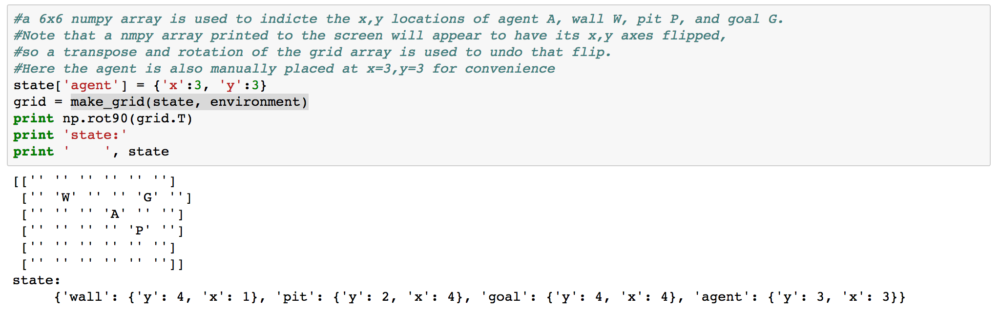
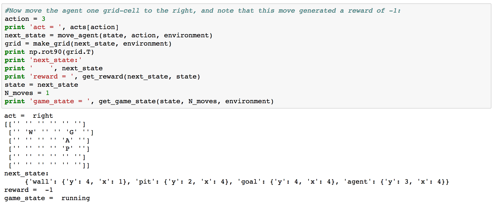

# grid_walker

by Joe Hahn, 
jmh.datasciences@gmail.com, 
3 February 2018 
git branch=master

### Summary:
This grid_walker demo uses Q-learning to teach a neural net AI how to navigate an agent
about a very simple 6x6 grid, guiding it towards a goal while avoiding obstacles and hazards.

This version of grid_walker was adapted from a blog post by Outlace,
http://outlace.com/rlpart3.html. Outlace's original code was a sub-optimal mess,
while I like to think this version is less so. Nonetheless his description of the
Q-learning algorithm is excellent and worth a read.

### Setup:

Clone this repo:

    git clone https://github.com/joehahn/grid_walker.git
    cd grid_walker

Note that I am executing grid_walker on a Mac laptop where I've installed
Anaconda python 2.7 plus a few other needed libraries via:

    wget https://repo.continuum.io/miniconda/Miniconda2-latest-MacOSX-x86_64.sh
    chmod +x ./Miniconda2-latest-MacOSX-x86_64.sh
    ./Miniconda2-latest-MacOSX-x86_64.sh -b -p ~/miniconda2
    ~/miniconda2/bin/conda install -y jupyter
    ~/miniconda2/bin/conda install -y keras

### Execute:

Start Jupyter notebook via

    jupyter notebook

and load the grid_walker.ipynb notebook > Run.

### Results:

Grid_walker is a simple game that consistes of 4 objects: an agent A, wall W, pit P, and goal G,
with these objects inhabiting a 6x6 grid. In the following, a 6x6 string array is used
to track and display the locations of all 4 objects:

Only the agent is mobile while the other 3 objects P G and W remain at the same locations
during the every game.

Using the functionality provided in grid_walker.py, the agent can be instructed to move
to an adjacent grid cell, and in the following the agent A was
instructed to move one cell to the right, which also generated a small reward
ie cost of -1

while moving the agent up and onto the goal G instead generates a reward of 10

which also changes the game_state from 'running' to 'goal' and concludes the game.

then...
