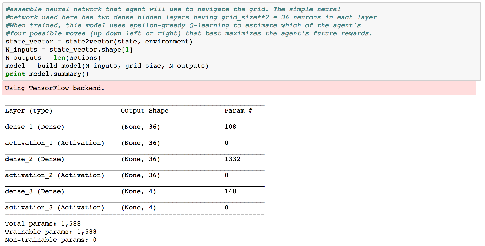
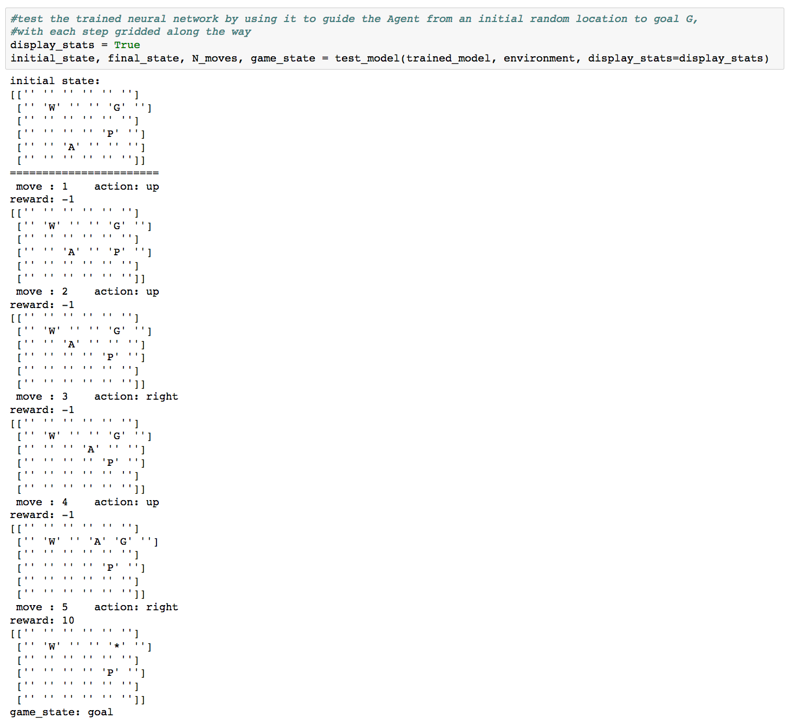

# grid_walker

by Joe Hahn, 
jmh.datasciences@gmail.com, 
3 February 2018 
git branch=master

### Summary:
This grid_walker demo uses Q-learning to teach a neural net AI how to navigate an agent
about a very simple 6x6 grid, guiding it towards a goal while avoiding obstacles and hazards.

This version of grid_walker was adapted from a blog post by Outlace,
http://outlace.com/rlpart3.html. Outlace's original code was a sub-optimal mess,
while I like to think this version is less so. Nonetheless his description of the
Q-learning algorithm is excellent and worth a read.

### Setup:

Clone this repo:

    git clone https://github.com/joehahn/grid_walker.git
    cd grid_walker

Note that I am executing grid_walker on a Mac laptop where I've installed
Anaconda python 2.7 plus a few other needed libraries via:

    wget https://repo.continuum.io/miniconda/Miniconda2-latest-MacOSX-x86_64.sh
    chmod +x ./Miniconda2-latest-MacOSX-x86_64.sh
    ./Miniconda2-latest-MacOSX-x86_64.sh -b -p ~/miniconda2
    ~/miniconda2/bin/conda install -y jupyter
    ~/miniconda2/bin/conda install -y keras

### Execute:

Start Jupyter notebook via

    jupyter notebook

and load the grid_walker.ipynb notebook > Run.

### Results:

Grid_walker is a simple game that consistes of 4 objects: an agent A, wall W, pit P, and goal G,
with these objects inhabiting a 6x6 grid. In the following, a 6x6 string array is used
to track and display the locations of all 4 objects:

Only the agent is mobile while the other 3 objects P G and W remain at the same locations
during the every game.

Using the functionality provided in grid_walker.py, the agent can be instructed to move
to an adjacent grid cell, and in the following the agent A was
instructed to move one cell to the right, which also generated a small reward
ie cost of -1

The agent is then moved up and onto the goal G which then generates a reward of 10

and changes the game_state from 'running' to 'goal' to indicate the conclusion of
this the game. The pit P is a hazard, and moving the agent there ends the game with
a reward of -10. Also the agent is not allowed to move onto wall W or beyond the 6x6 grid,
and trying do so generates a reward of -3. 

The purpose of the grid_walker demo is to build a neural-network based AI that will
advise the agent on how to navigate across this grid towards goal G without bumping to
the hazards W or P. This demo uses keras to build a two-hidden-layer net that are
each composed of 36 neurons

The build_model() function,
https://github.com/joehahn/grid_walker/blob/master/grid_walker.py#L146#L161,
is where keras + tensorflow are used to assemble that neural net model.

The model is then trained using epsilon-greedy Q-learning:  

initially the agent wanders the grid randomly while gathering (mostly negative) rewards.
But in later training games the random moves are ramped down as the AI learns how to 
nudge the agent in the direction of maximum future rewards; see the source
for more details on how Q-learning is used to train the AI,
https://github.com/joehahn/grid_walker/blob/master/grid_walker.py#L164#L248

To test the now-trained neural network model _trained\_model_, call the test_model() function
which uses the model to play a complete game of grid_walker,

